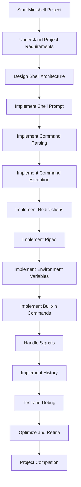

# minishell_GHADIR
(Progress)

Here's a more comprehensive breakdown of the steps involved:

1. **Analyze the Parsed Input**:
   - Create a function to process the linked list of tokens, e.g., `execute_command()`.
   - Iterate through the linked list and categorize the tokens:
     - Identify the command (first token)
     - Collect the arguments (subsequent tokens)
     - Detect any redirection operators (`<`, `>`, `<<`, `>>`)
     - Check for the pipe `|` operator

2. **Handle Built-in Commands**:
   - Implement the logic for each built-in command (e.g., `echo`, `cd`, `pwd`, `export`, `unset`, `env`, `exit`).
   - For each built-in command, write a dedicated function that takes the necessary arguments and performs the required action.
   - For example, the `cd` command function would use the `chdir()` system call to change the current working directory.

3. **Execute External Commands**:
   - If the command is not a built-in, it's an external command that needs to be executed.
   - Use the `fork()` system call to create a child process.
   - In the child process, use `execve()` to replace the child process image with the external command.
   - In the parent process, use `wait()` to wait for the child process to finish execution.

4. **Handle Redirections**:
   - Detect any redirection operators in the token list.
   - Before executing the command (built-in or external), modify the file descriptors (`stdin`, `stdout`, `stderr`) of the child process to implement the desired redirection.
   - Use `dup2()` to redirect `stdin` or `stdout` to the appropriate file.

5. **Implement Pipes**:
   - If you find the pipe `|` operator, create a pipe using `pipe()`.
   - Fork two child processes: one to handle the command before the pipe, and one to handle the command after the pipe.
   - Connect the output of the first child process to the input of the second child process using the pipe.
   - Repeat the redirection and command execution steps for each child process.

6. **Handle Environment Variables**:
   - When you encounter a token that starts with `$`, replace it with the value of the corresponding environment variable.
   - Use `getenv()` to retrieve the value of an environment variable.

7. **Manage Signals**:
   - Set up signal handlers using `signal()` or `sigaction()` to handle `ctrl-C`, `ctrl-D`, and `ctrl-\`.
   - Ensure that your Minishell behaves correctly when these signals are received.

8. **Implement History**:
   - Maintain a history of executed commands, either in a linked list or an array.
   - Provide a way for the user to recall and re-execute previous commands, such as using the up/down arrow keys.

9. **Error Handling and Reporting**:
   - Use `perror()` and `strerror()` to handle and report system-level errors.
   - Provide meaningful feedback to the user when issues occur.

