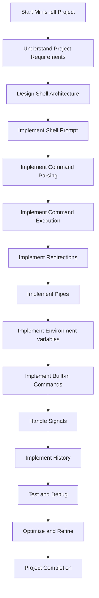

# minishell_GHADIR
(Progress)

Understood. Since you've already completed the Command Parsing step and have a linked list structure for your tokens, let's dive into the next step: Implement Command Execution.

The key here is to bridge the gap between the parsed input and the actual execution of the command. Here's a step-by-step approach you can follow:

1. **Analyze the Parsed Input**:
   - Iterate through the linked list of tokens to understand the structure of the user's input.
   - Identify the different components, such as the command, arguments, redirections, and pipes.
   - Determine if the input represents a built-in command or an external command that needs to be executed.

2. **Handle Built-in Commands**:
   - Check if the first token (the command) matches any of the built-in commands your Minishell supports (e.g., `echo`, `cd`, `pwd`, `export`, `unset`, `env`, `exit`).
   - If it's a built-in command, execute the corresponding function or logic directly within your Minishell.
   - For example, for the `cd` command, you can use the `chdir()` system call to change the current working directory.

3. **Execute External Commands**:
   - If the first token is not a built-in command, it represents an external command that needs to be executed.
   - Use the `fork()` system call to create a child process that will execute the external command.
   - In the child process, use the `execve()` system call to replace the child process image with the external command.
   - In the parent process, use the `wait()` system call to wait for the child process to finish execution.

4. **Handle Redirections**:
   - Identify any redirection operators (`<`, `>`, `<<`, `>>`) in the token list.
   - Modify the file descriptors (`stdin`, `stdout`, `stderr`) of the child process to implement the desired redirection.
   - For example, use `dup2()` to redirect `stdin` or `stdout` to the appropriate file.

5. **Implement Pipes**:
   - If you find the pipe `|` operator in the token list, create a pipe using the `pipe()` system call.
   - Fork two child processes: one to handle the command before the pipe, and one to handle the command after the pipe.
   - Connect the output of the first child process to the input of the second child process using the pipe.
   - Repeat the redirection and command execution steps for each child process.

6. **Handle Environment Variables**:
   - When you encounter a token that starts with `$`, replace it with the value of the corresponding environment variable.
   - You can use the `getenv()` system call to retrieve the value of an environment variable.

7. **Manage Signals**:
   - Ensure that your Minishell correctly handles signals, such as `ctrl-C`, `ctrl-D`, and `ctrl-\`.
   - Use the `signal()` or `sigaction()` system calls to set up signal handlers and define the desired behavior.

8. **Implement History**:
   - As the user enters commands, add them to a history data structure (e.g., a linked list or an array).
   - Provide a way for the user to recall and re-execute previous commands, such as by using the up/down arrow keys.

9. **Error Handling and Reporting**:
   - Implement robust error handling and reporting mechanisms to provide meaningful feedback to the user.
   - Use the `perror()` and `strerror()` functions to handle and report system-level errors.

Remember, the key to successfully implementing the Command Execution step is to seamlessly integrate the parsed input with the appropriate system calls and internal logic to execute the user's commands. Take it step by step, and refer to the provided external function list and the Bash shell behavior as a reference.

Let me know if you have any questions or need further assistance as you work through this part of the Minishell project.
