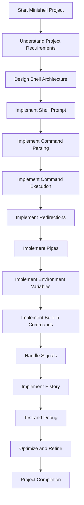

# minishell_GHADIR
(Progress)

```mermaid
flowchart TD
    A[Start Minishell Project] --> B[Understand Project Requirements]
    B --> C[Design Shell Architecture]
    C --> D[Implement Shell Prompt]
    D --> E[Implement Command Parsing]
    E --> F[Implement Command Execution]
    F --> G[Implement Redirections]
    G --> H[Implement Pipes]
    H --> I[Implement Environment Variables]
    I --> J[Implement Built-in Commands]
    J --> K[Handle Signals]
    K --> L[Implement History]
    L --> M[Test and Debug]
    M --> N[Optimize and Refine]
    N --> O[Project Completion]
```
